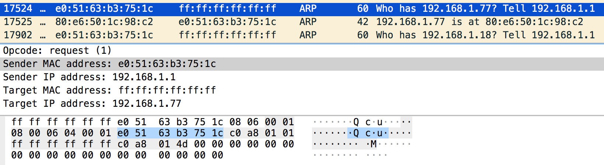
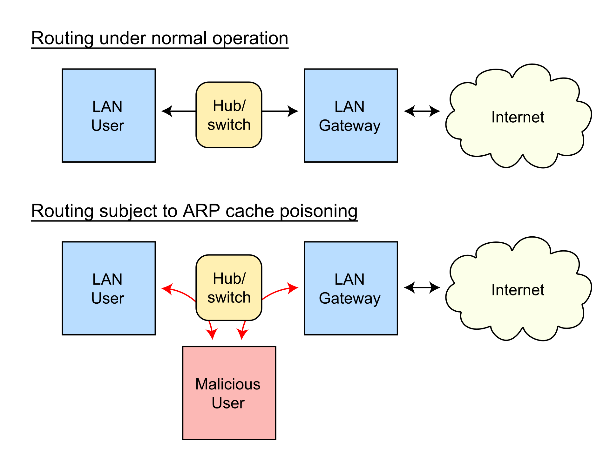

[https://github.com/knifecake/arp-poison ](https://github.com/knifecake/arp-poison)

----------------------------------

## ARP: Address Resolution Protocol

- ARP-Request: `Who-has 192.168.4.20? Tell 192.168.1.1?`
- ARP-Response: `192.168.4.20 is at f0:f3:e4:c2:01:b3`



-------------------------------

## ARP packets

:::::::::::::: {.columns}
::: {.column width="40%"}


<small>Source: Wikipedia</small>
:::
::: {.column width="60%"}

- Ejemplo de ARP sobre Ethernet e IP

:::
::::::::::::::

--------------------------------

## Algoritmo de recepción de ARP-Requests

```
?Do I have the hardware type in ar$hrd?
Yes: (almost definitely)
  [optionally check the hardware length ar$hln]
  ?Do I speak the protocol in ar$pro?
  Yes:
    [optionally check the protocol length ar$pln]
    Merge_flag := false
    If the pair <protocol type, sender protocol address> is
        already in my translation table, update the sender
        hardware address field of the entry with the new
        information in the packet and set Merge_flag to true.
    ?Am I the target protocol address?
    Yes:
      If Merge_flag is false, add the triplet <protocol type,
          sender protocol address, sender hardware address> to
          the translation table.
      ?Is the opcode ares_op$REQUEST?  (NOW look at the opcode!!)
      Yes:
        Swap hardware and protocol fields, putting the local
            hardware and protocol addresses in the sender fields.
        Set the ar$op field to ares_op$REPLY
        Send the packet to the (new) target hardware address on
        the same hardware on which the request was received.
```

::: notes

- RFC826 1982. David C. Plummer. MIT.


- No es imprescindible que seamos el target.

:::


-----------------------------------------------------


### ¿Por qué?

> Periodic broadcasting is definitely not desired.

::: notes

- La especificación asume que el tráfico se dará entre pares: no todos
  necesitan conocer las direcciones de todos.
- Aprovechamiento de recursos de red.
- No hace falta que cada host haga *broadcast* de su dirección ya que los que
  se quieran comunicar con él conocerán su dirección.

:::

------------------------------------------------------

### ¿Por qué nos importa?

. . .





------------------------------------------------------

### ¿Cómo lo hacemos?
. . .

1. Crear un paquete ARP-Request con los campos

```
HW src: <mi dirección MAC>
Prot src: <IP del gateway>
Prot dst: <IP de la víctima>*
```

2. Envolverlo en un paquete Ethernet dirigido exclusivamente a la víctima:
   - No hacer *broadcast* nos mantiene ocultos

3. Enviar!**


::: notes

 - No es imprescindible Port dst
 - Puede que haya que repetir cada pocos segundos

:::

----------------------------------------------------------


----------------------------------------------------------

# Demo
