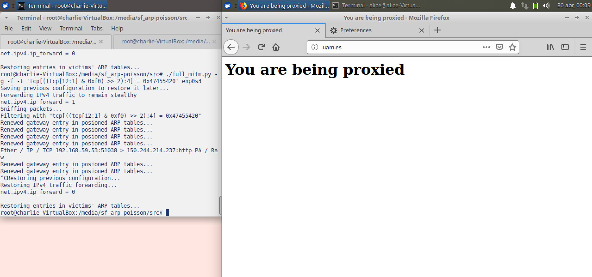

## Introduction

ARP protocol description


## Anatomy of a request-based ARP spoffing attack

An ARP spoofing attack is accomplished by crafting a special ARP packet and
sending it through the network. The ARP specification defines to kinds of
packets: request or *who-has* packets and response or *is-at* packets. In this
paper we will focus on attacks based on spoofing the first kind of packets.

Normally, a who-has ARP packet contains the following fields:

\Begin{multicols}{2}

```
!bash
~~~~~
protocol -f docs/arp-protocol-spec.txt -b 16
~~~~~
```
\End{multicols}

Here, protocol address normally refers to an IP address and hardware address
refers to a 48-bit Ethernet or MAC address although the protocol can be
extended to support other implementations of the link and network layers. This
is why there are fields for setting the protocol and hardware address lengths.
Also, note that the previous diagram includes the Ethernet header (source,
destination and ethertype) that is not normally visible to the ARP daemon. The
bare minimum needed to insert a record in the target's ARP cache table using an
ARP request packet is to set the protocol and hardware source addresses and to
route that packet to the target somehow. The latter is normally accomplished by
setting the Ethernet destination address to the MAC addres of the target host
or to the broadcast address of the LAN. However, choosing to broadcast the ARP
packet to all the network may give away the fact that we are trying to poison
an ARP table to a hypothetical monitoring system in place on the network. How
altering the source addresses causes an entry to be added to the target's ARP
cache table will be discussed in a minute.

Normally, it is not necessary to set the rest of the fields to precise values
but they should not be completely ignored. Bear in mind that an ARP request
packet triggers an ARP response if the destination protocol address matches
that of the target's interface.  Because we changed the source addresses to
spoof another host, the ARP response packet will be sent to the host we are
trying to impersonate (in many cases the network gateway).[^1] Again this is
not desired as it might blow the whistle on our [illicit] activities. To ensure
an ARP response is not generated one should set the destination protocol
address to a different one from the one associated with the target's interface.
As for the destination hardware address, it's value does not matter (this field
is reserved for ARP response packets) and is normally set to 0.

[^1]: The ethernet-layer source address is not used (remember this is hidden
from the ARP daemon and thus its value does not matter).

---

Now we will look at the way the ARP protocol handles incoming ARP packets.
Thanks to a detail in the specification of the protocol we can insert a spoofed
record into the target's ARP cache table without implementing a full ARP
request-response transaction.

The algorithm for handling ARP request packets that arrive on a host is the
following (described in [@RFC826]). Negative conditionals indicate an end of processing and a discarding
of the packet.

```

?Do I have the hardware type in ar$hrd?
Yes: (almost definitely)
  [optionally check the hardware length ar$hln]
  ?Do I speak the protocol in ar$pro?
  Yes:
    [optionally check the protocol length ar$pln]
    Merge_flag := false
    If the pair <protocol type, sender protocol address> is
        already in my translation table, update the sender
        hardware address field of the entry with the new
        information in the packet and set Merge_flag to true.
    ?Am I the target protocol address?
    Yes:
      If Merge_flag is false, add the triplet <protocol type,
          sender protocol address, sender hardware address> to
          the translation table.
      ?Is the opcode ares_op$REQUEST?  (NOW look at the opcode!!)
      Yes:
        Swap hardware and protocol fields, putting the local
            hardware and protocol addresses in the sender fields.
        Set the ar$op field to ares_op$REPLY
        Send the packet to the (new) target hardware address on
        the same hardware on which the request was received.
```

Excerpt from [@RFC826]:

Notice that the `<protocol type, sender protocol address, sender hardware
address>` triplet is merged into the table before the opcode is looked at.  This
is on the assumption that communication is bidirectional; if A has some reason
to talk to B, then B will probably have some reason to talk to A.  Notice also
that if an entry already exists for the `<protocol type, sender protocol
address>` pair, then the new hardware address supersedes the old one.

In practice, an attacker must keep sending these packets at short intervals as
the ARP cache expiration times are brief on some operating systems.

| OS/Distribution                                       	| ARP cache expiration time                                                                                     	|
|-------------------------------------------------------	|---------------------------------------------------------------------------------------------------------------	|
| MacOS (tested on Sierra - 10.12.6)                    	| ~20 min since entry was added if validated (if connections work) [@bsd-arp-cache]                             	|
| Ubuntu 18.04 (Linux kernel version 4.18.0-17-generic) 	| 60 seconds since entry was last used [^2]                                                                     	|
| BSD                                                   	| ~20 minutes since addition if validated [@bsd-arp-cache]                                                      	|
| Windows Vista                                         	| random value between 15 and 45 seconds [@vista-arp-cache]                                                     	|
| Cisco switches and routers                            	| defaults to 4 hours to account for the large number of ARP entries on routers and switches [@cisco-arp-cache] 	|


[^2]: Got from running `cat /proc/sys/net/ipv4/neigh/default/gc_stale_time` on a Linux machine.


## Implementation of an ARP spoofing attack

The main goal of this paper is to verify that the methodology described earlier
still applies to modern operating systems. To test this we develop a custom
tool that is capable of detecting the LAN configuration (i.e. gateway
addresses) and can poison a target's ARP tables with an entry that causes all
traffic bound outside the LAN to be routed through the attacker (i.e. spoofing
the gateway).

This tool is anything but novel. There exist plenty of well established
solutions to this problem. From simple packet crafting programmes such as
*nemesis* to fully-fledged network analysis tools such as *Ettercap*. Our goal
was to understand the subtleties of carrying out this attack. We base our tool
on the *scapy* python library that aids us in handling the lower level
networking details. Administrator privileges are required when running the
program as traffic must be directly injected at the link layer level.

Implementation was relatively straightforward given that scapy already provides
a wrapper around ARP packets. We create another wrapper around scapy's as a
python script that takes the interface name plus the six address fields
described in the diagram of the ARP request packet as parameters. Not all
arguments are compulsory. Instead, sensible defaults are chosen when the user
leaves out some fields.

To test our implementation in a safe manner we deploy a virtualised *host-only*
network on VirtualBox consisting of three virtual machines acting as
router/gateway, attacker and target respectively. We configure them to use
static IP addresses using *netplan* (our machines are based on Ubuntu 18.04)
and configure the default gateway of the second and third machines to point to
the first. To enable the machines to connect to the internet we set up a second
NAT-network adapter on the router machine. Then we add the appropriate
*iptables* rules to the router machine to forward all outbound traffic through
this second interface using NAT. The final network topology is the following:

{ width=45% }

The developed program is called `req_infect.py` and is included in the
supplementary material. Information about the how to execute it can be found
with `./req_infect.py -h` and an example is provided below:

```
attacker$ ./req_infect.py enp0s3 --victim_addr 192.168.59.53
No address to forge supplied. Using default gateway (192.168.59.51)

Sent spoofed ARP packet to 192.168.59.53 (f0:ff:ff:ff:ff:03) pretending to be
192.168.59.51 (f0:ff:ff:ff:ff:03).
Ethernet headers: source = f0:ff:ff:ff:ff:02, destination = ff:ff:ff:ff:ff:ff
```

Then we check that the target machine was in fact poisoned:

```
target$ arp -n
Address                  HWtype  HWaddress           Flags Mask            Iface
192.168.59.51            ether   f0:ff:ff:ff:ff:02   C                     enp0s3
```

At this point, poisoning the target's ARP table such that we impersonate the
default gateway effectively isolates the target machine from the internet
because the attacker does not forward traffic. In the next section we explore
mechanism through which we can still allow traffic to flow to the outside world
but still retain control even if only for sniffing purposes.

On the virtualised network we found that we needed 2 spoofed ARP
request packets to convince a target of the new ARP entry on average. We
recognise this might be a matter of chance as one should suffice in principle
but we must take into account that the gateway we are trying to impersonate
also sends its own ARP packets and therefore competes with us to get an
ARP entry into the target's cache table.

It is also of interest to see how these kinds of attacks perform on other kinds
of networks. On a domestic network... TODO

On the bigger, more professional side, we test this kind of attack in a
university network. We get no results as the network blocks any kind of
communication between hosts including ARP traffic. This is a heavy
countermeasure against ARP spoofing attacks that should probably be the norm in
public networks with a large number of [untrusted] users. This and other
defences will be discussed later.

TODO test on another public network

## Implementation of a MitM attack utilising ARP poisoning

In this section we demonstrate how a combination of ARP spoofing and
appropriate routing rules are sufficient to implement a basic Man-in-the-Middle
or impersonation attack. In the next section we will use these building blocks
to build a more sophisticated sniffer that is capable of modifying traffic as
it passes through it.

We develop another utility capable of keeping a target's ARP cache table
poisoned by continuously sending spoofed ARP-request packets. In parallel, the
tool listens for traffic through the interface used to carry out the ARP
poisoning attack and logs it. In addition, this new tool configures IP
forwarding so that traffic between the target and the internet is not
disrupted, ensuring we remain stealthy.

Usage of this tool is also simple. The tool is called `full_mitm.py` and can be
found in the suplementary material. Like the previous, more information about
the usage can be obtained by execurting `./full_mitm.py -h`. We provide sample
output below:

```
./full_mitm.py -f -g enp0s3
Saving previous configuration to restore it later...
Forwarding IPv4 traffic to remain stealthy
net.ipv4.ip_forward = 1
Sniffing packets...
Ether / ARP who has 0.0.0.0 says 192.168.59.51
Renewed gateway entry in posioned ARP tables...
Ether / IP / ICMP 192.168.59.53 > 1.1.1.1 echo-request 0 / Raw
Ether / ARP who has 192.168.59.53 says 192.168.59.52
Ether / IP / ICMP 192.168.59.53 > 1.1.1.1 echo-request 0 / Raw
Ether / IP / ICMP 192.168.59.52 > 192.168.59.53 redirect host-redirect / IPerror / ICMPerror / Raw
Ether / IP / ICMP 1.1.1.1 > 192.168.59.53 echo-reply 0 / Raw
Ether / IP / ICMP 192.168.59.53 > 1.1.1.1 echo-request 0 / Raw
Ether / IP / ICMP 192.168.59.52 > 192.168.59.53 redirect host-redirect / IPerror / ICMPerror / Raw
Ether / IP / ICMP 192.168.59.53 > 1.1.1.1 echo-request 0 / Raw
Ether / IP / ICMP 1.1.1.1 > 192.168.59.53 echo-reply 0 / Raw
Renewed gateway entry in posioned ARP tables...
Ether / ARP who has 0.0.0.0 says 192.168.59.51
^CRestoring previous configuration...
Restoring IPv4 traffic forwarding...
net.ipv4.ip_forward = 0

Restoring entries in victims' ARP tables...
```

We can see how the attacker keeps sending ARP-request packets every few seconds
and how the victim performed a `ping` that was intercepted by the attacker. The
target received a response thanks to IPv4 forwarding and thus did not notice
its traffic was being monitored.

Also, as our tools became more sophisticated and powerful we added the ability
to restore both internal and external network configuration when a sniffing
session ends. That is, we restore both the previous configuration of the IPv4
forwarding directive on the attacker machine as well as the gateway ARP cache
entry on the target machine by sending a couple of legitimate ARP packets.


## HTTP proxy with zero client configuration using ARP poisoning

Now we will explore a practical, not necessarily blackhat application of ARP
spoofing. Suppose we need to introduce an HTTP proxy between computers in our
LAN and the internet but cannot change the network configuration of those
computers (i.e. we cannot configure them to forward traffic to our proxy but
rather we need to intercept it). Also suppose that DHCP is not available and
that the target machines have a statically configured gateway IP and that we
cannot replace this router with another that does proxying for us. In other
words, we want to set up a transparent HTTP proxy.

We decide to use ARP spoofing to impersonate the gateway IP and route all
outgoing traffic through the attacker as we did earlier, only this time we set
up additional routing rules on the target machine to route outgoing HTTP
traffic through our proxy. First, we develop a simple HTTP proxy (see
`http_proxy.py` in the supplementary material) that will always return an HTML
page informing the user that they are being proxied. Then we set up the
appropriate `iptables` rules to forward all TCP traffic directed to port 80
(HTTP) that goes through the attacker machine as a result of the spoofing to
another port on the attacker machine where our proxy serve is listening. More
specifically, the appropriate `iptables` rule is the following:

```
iptables -t nat -A PREROUTING -i enp0s3 -p tcp --dport 80 -j REDIRECT --to-port 8080
```

In addition we disable ICMP forwarding as our network configuration is not the
most optimal and target machines might pick up on this through the
aforementioned protocol.[^3]

[^3]: Done with `sysctl -w net.ipv4.conf.all.send_redirects=0`.




## References
